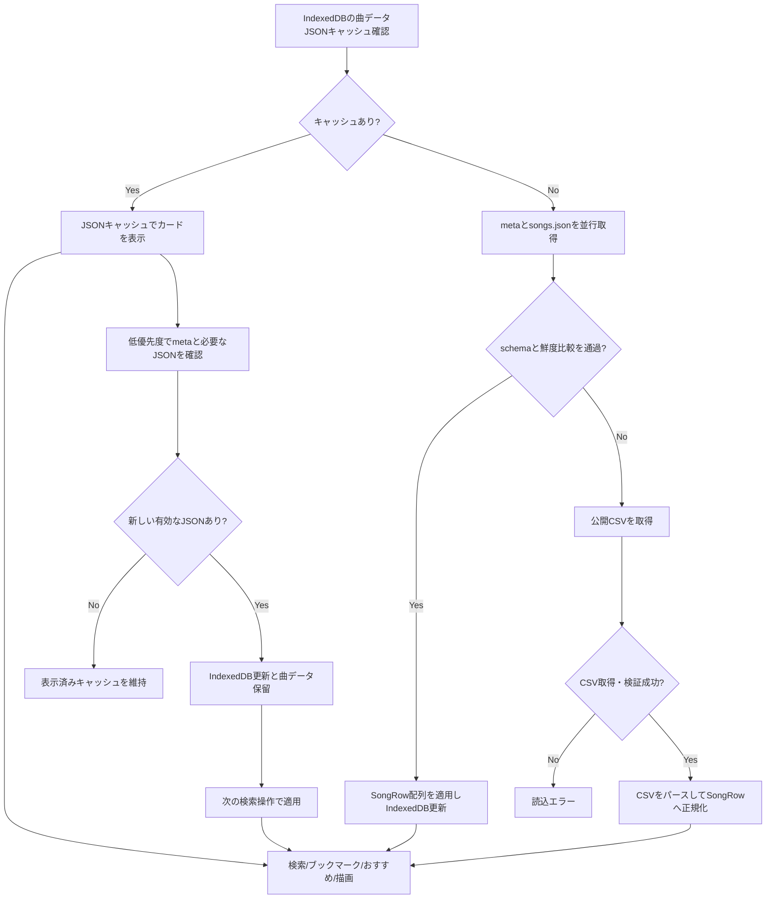
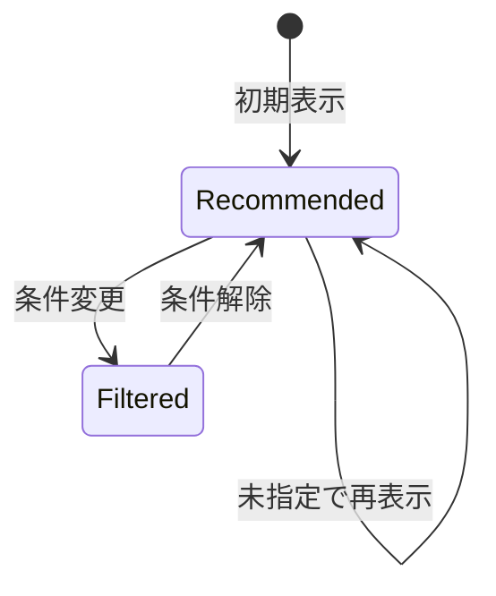
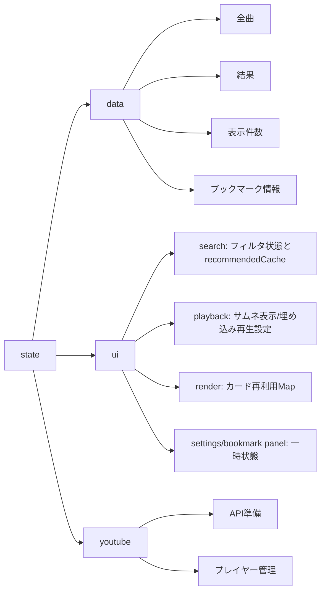

# 鐘輝かう 歌サーチ 設計書（概要）

## 目的
公開スプレッドシートの歌データを検索・絞り込みし、YouTube動画へアクセスしやすくする。

## 対象ユーザー
- 配信/歌みた/ショート/切り抜き/収録を探したい視聴者
- PC/スマホの両方から利用するユーザー

## 全体構成
- 静的フロントエンドのみ（HTML/CSS/JavaScript, ES Modules）。
  `app/**/*.mts` を source とし、`npm run build:ts` で `_build/app/**/*.mjs` へ生成した JavaScript をブラウザ・テスト・Node scripts が読む
- データ取得：事前生成JSON（`data/songs.json` / `data/songs-meta.json`）を優先し、唯一のマスターである公開スプレッドシートのCSVを生成元とフォールバックに使う
- データ生成/公開：GitHub Actions でCSVから派生JSONを生成・検証し、差分を `main` へコミットして CI を起動する。CI 成功後、検証済み commit を deploy 前後に現在の `main` と照合し、公開された `deployment.json` の commit SHA を確認する
- CI：GitHub Actions で TypeScript emit、曲データ検証、typecheck、lint、unit test、静的 site build を実行する
- 実行時の同梱外部ライブラリ依存：なし
- 埋め込み再生まわりでは YouTube Iframe API を動的に利用し、標準では `youtube.com`、プライバシー強化設定ON時は `youtube-nocookie.com` の埋め込みURLを使う
- 開発時確認：TypeScript emit 同期、曲データJSON検証、TypeScript noEmit typecheck、ESLint、Node.js 標準 `node:test`、Playwright Chromium smoke を利用
- 型安全性は `app/**/*.mts` の TypeScript source を中心に高め、生成 JavaScript は `_build/app` に限定する。
  実行時に npm 等の同梱依存は持たず、配布物は HTML/CSS/JavaScript の静的 asset とする。

## テスト方針（現状）
- 対象: 検索ロジック、日付フィルタ、ブックマーク検索、描画/再生/保存/サイドバーまわりの回帰
- 重点ケース: ブックマーク表示時のみ有効なドラッグ並び替えと、並び順の永続化、YouTube 継続再生の失敗復旧
- テストファイル:
  - `tests/bookmark-storage-schema.test.mjs`
  - `tests/bookmark-import-export-ui.test.mjs`
  - `tests/bookmark-transfer.test.mjs`
  - `tests/bookmark-ui.test.mjs`
  - `tests/app-state.test.mjs`
  - `tests/stream-role.test.mjs`
  - `tests/csv-parser.test.mjs`
  - `tests/data-loader.test.mjs`
  - `tests/dom-utils.test.mjs`
  - `tests/date-filter-controller.test.mjs`
  - `tests/date-key.test.mjs`
  - `tests/partial-date.test.mjs`
  - `tests/search-boolean-filters.test.mjs`
  - `tests/search-controller.test.mjs`
  - `tests/search-filters.test.mjs`
  - `tests/search-query.test.mjs`
  - `tests/search-query-validation.test.mjs`
  - `tests/search-recommendation.test.mjs`
  - `tests/song-format.test.mjs`
  - `tests/format-filter.test.mjs`
  - `tests/pages-artifact.test.mjs`
  - `tests/playback-sequence.test.mjs`
  - `tests/playback-session-controller.test.mjs`
  - `tests/playback-settings-value-reducer.test.mjs`
  - `tests/render-drag-reorder.test.mjs`
  - `tests/render-layout.test.mjs`
  - `tests/render-masonry-layout.test.mjs`
  - `tests/search-filters-controller.test.mjs`
  - `tests/search-state-schema.test.mjs`
  - `tests/sidebar-ui.test.mjs`
  - `tests/storage-bookmark-limit.test.mjs`
  - `tests/storage-search-state.test.mjs`
  - `tests/ui-storage-compat.test.mjs`
  - `tests/ui-sync.test.mjs`
  - `tests/youtube-controller.test.mjs`
  - `tests/youtube-embed.test.mjs`
  - `tests/youtube-playback-start-attempt.test.mjs`
  - `tests/youtube-playback-state.test.mjs`
  - `tests/youtube-player-adapter.test.mjs`
  - `tests/youtube-shared-playback.test.mjs`
  - `tests/youtube-thumbnail.test.mjs`
  - `tests/youtube-unconfirmed-playback-start.test.mjs`
  - `tests/layout-anchor.test.mjs`
  - `tests/results-scroll.test.mjs`
  - `tests/e2e/youtube-smoke.spec.mjs`
  - `tests/songs-content-hash.test.mjs`
  - `tests/songs-data-source.test.mjs`
  - `tests/songs-data-quality.test.mjs`
  - `tests/build-songs-json.test.mjs`
  - `tests/songs-json-cache.test.mjs`
  - `tests/songs-json.test.mjs`
  - `tests/songs-json-validation.test.mjs`
- 補助モジュール:
  - `tests/test-helpers.mjs`
  - `tests/youtube-harness.mjs`
  - `tests/support/playback-settings-fixture.mjs`
  - `tests/e2e/support/mock-youtube.mjs`
  - `tests/e2e/support/ui-helpers.mjs`
- 実行コマンド:
  - `npm run validate:songs-json`
  - `npm run build:ts`
  - `npm run typecheck`
  - `npm run check:ts-emit`
  - `npm run build`
  - `npm run lint`
  - `npm run test:unit` (`node --test tests/*.mjs`)
  - `npm run test:e2e`

## 主要機能
- 検索（曲名/アーティスト名/読み、複数キーワード）
- 絞り込み（形態/コラボ種別/リレー/ハモリ/日付範囲）
- ブックマーク（作成/名称変更/削除/曲の追加・削除/選択/表示中の曲順並び替え）
- おすすめ表示（条件未指定時）
- 段階表示（追加読み込み）
- サムネイル表示、埋め込み再生、再生範囲設定、プライバシー強化設定
- テーマ切替（ダーク/ライト）

## UI構成
- **サイドバー**：検索・絞り込み・設定
  - 検索入力
  - 日付選択（年/月/日セレクト、From/To）
  - 形態フィルタ（配信/オリ曲/歌みた/ショート/切り抜き/収録。UI上はオリ曲/歌みたを1項目として扱う）
  - リレー/ハモリ/コラボ種別（歌枠リレー/ハモリあり/コラボ(ホスト)/コラボ(ゲスト)）
  - ブックマーク導線（専用パネルを開く）
  - 設定導線（専用パネルを開く）
- **サイドバー内設定パネル**：表示/再生設定
  - 表示
    - サムネイル表示
    - ダークモード切替
  - 再生
    - サムネイル表示ON時のみ再生セクションを表示
    - プライバシー強化（ONでは `youtube-nocookie.com` の埋め込みURLを使用）
    - アーカイブ全体を再生（OFFでは曲データの終了秒数で停止）
    - 実験的な連続再生/リピート設定は通常UIでは非表示にし、`window.knkPlaybackSettings` からページ内だけ有効化して検証する
- **サイドバー内ブックマークパネル**：ブックマーク一覧と曲追加
  - 一覧の選択/名称変更/削除
  - 曲カードの `+` 押下時は同パネル上で既存ブックマーク選択または新規作成して追加
  - JSON形式でのエクスポート/インポート。インポートは現在のブックマークを全置き換えする
- **メイン**：検索結果一覧（カード）
  - 曲名/アーティスト
  - 日付
  - タグ（形態/コラボ/リレー/ハモリ）
  - ブックマーク操作（追加/選択中ブックマークから削除）
  - ブックマーク表示中のみドラッグハンドルを表示し、ハンドル操作でカード順を並び替え
  - YouTubeリンク

## データフロー
1. IndexedDB の曲データJSONキャッシュを確認する。
2. 有効なキャッシュがあれば、その曲データで検索・おすすめを開始してカードを先に表示する。
3. 表示後、`songs-meta.json` と必要に応じて `songs.json` を低優先度で取得し、鮮度を確認する。
   - hash が一致する場合は日時を参照せず、表示済みキャッシュを維持する。
   - hash が異なり、キャッシュの生成日時が新しい場合も、表示済みキャッシュを維持する。
   - meta の生成日時が新しい、日時が同じ、または日時を比較できない場合は `songs.json` を取得する。
   - meta の取得・検証に失敗しても、`songs.json` 本体の取得は試す。
   - JSON本体を取得・採用できなくてもCSVへは進まず、表示済みの有効なキャッシュを維持する。
4. 取得した `songs.json` はschemaを検証し、metaがあればmeta、なければ既存JSONキャッシュを基準に
   同じ新旧判定を行う。hash一致またはJSON本体の生成日時が新しい場合だけIndexedDBへ保存する。
   内容が変わっていればメモリ上の保留データとし、表示中のカードは自動更新しない。
5. 次の検索操作時に保留データを適用し、通常検索・ブックマーク検索は新しい全曲データで一度だけ再計算する。
   日付候補の境界・indexを再構築しても現在の有効な年月日選択は維持する。おすすめは既存の曲と並びを
   できる限り維持し、欠けた行だけを補修する。
6. 有効なJSONキャッシュがない場合は `songs-meta.json` と `songs.json` を並行取得する。
   JSONを採用できなかった場合だけ公開CSVを取得し、`SongRow` に正規化する。CSVは実行時キャッシュへ保存しない。
7. metaはresponse受信と本文読込に各2秒、JSON本体はresponse受信に2秒・本文読込に30秒、CSVは
   response受信に3秒・本文読込に30秒の期限を設ける。大きい本文の転送は短いresponse期限から切り離し、
   各段階が停止した場合は期限後に後続の取得元へ進む。
8. （ブックマーク選択中なら）ブックマーク内の曲集合を解決する。
9. 条件未指定ならおすすめ結果を解決し、通常時は検索条件を取得してフィルタする。
10. 結果一覧を描画し、通常検索/ブックマーク検索時のみ段階表示を有効化する。

### マスターCSVと派生JSON
- 公開スプレッドシートのCSVを唯一のマスターデータとする。JSONを直接修正する更新経路や、
  JSONからCSVへ戻す経路は持たない
- `songs.json` / `songs-meta.json` は、現在表示・再生可能な曲を配信する派生成果物とする
- 両JSONはschema Version 3として、同じ `contentHash` とUTC ISO 8601形式の `generatedAt` を持つ。
  `generatedAt` はcontentHashが変わった場合だけ更新し、同じ内容の定期生成では引き継ぐ
- 実行時は現行schemaだけを受け付け、旧schemaのJSONキャッシュは削除して未キャッシュと同じ取得経路へ進む
- 公開対象でもURLが空の行は、現在再生できない曲の履歴としてCSVへ残し、エラーにせず派生JSONから除外する。
  URLが非空で不正な場合は品質エラーとして生成を停止する
- CSVから公開対象曲へ変換した直後に、必須文字列、YouTube URL・動画ID、再生範囲、
  `archiveOrder`の整数性、曲参照キーの生成規則と一意性を全件検証する。
  問題はCSV行番号と曲名でまとめて報告し、検証成功前はどちらのJSONも書き換えない
- CSV行番号は変換中だけ曲候補と同じオブジェクトに保持し、`SongRow`や派生JSONには含めない
- 開始位置`0`と終了位置`null`は、ショート・切り抜き・歌みたなどの動画全体を再生する正常値とする。
  非空の不正な終了時刻・画面の向きに対する既存の警告とフォールバックは維持する
- ブラウザのCSVフォールバックも同じ変換・品質検証を通し、CSVは検証前後を問わず保存しない
- 派生JSONの検証では、両ファイルの構文、各曲の必須フィールド・型・未知フィールドを含むスキーマ、
  曲参照キーの生成規則と一意性、
  `contentHash`と`generatedAt`同士の一致、曲配列から再計算したhashとの一致だけを確認し、
  曲データの意味的品質は再判定しない

## データモデル（概要）
`SongRow`
- date / dateKey / archiveId / archiveOrder
- videoId / songKey / bookmarkSongKey / legacySongKey / format / streamRole / videoOrientation / isRelay / isHarmony
- title / artist / titleYomi / artistYomi
- endSeconds
- titleNorm / artistNorm / titleYomiNorm / artistYomiNorm
- url

### 曲参照キーの役割分担
- `songKey`: `archiveId::archiveOrder` を使う内部参照キー。カード再利用、描画更新、既存の画面内処理で利用する。
- `bookmarkSongKey`: `videoId::archiveOrder` を優先するブックマーク保存用キー。`videoId` を抽出できない場合は `songKey` へフォールバックする。
- キー生成、旧参照の正規化、参照インデックス構築、一意性検証は`song-identity`へ集約する。
- ブックマーク検索では `bookmarkSongKey` を優先して曲行へ解決し、旧ブックマークの `songKey` / `legacySongKey` は現行キーへ移行する。
- 旧数値参照はCSV行位置の変化で別の曲を指し得るため解決せず、実行時モデルへ持ち込まず読み込み時に除外する。

## 検索・絞り込みロジック
- 検索語：NFKC・読み・大小文字・連続空白を正規化したAND検索。曲データ側にも同じ空白正規化を適用する。
  空白区切りの語に加え、二重引用符で囲んだ範囲を1つの検索フレーズとして扱う
- 引用符は検索要素の境界とし、空白がなくても引用部分と非引用部分を分割する。
  `foo""bar` は `foo` と `bar`、`foo"bar baz"qux` は `foo`、`bar baz`、`qux` としてAND検索する。
  引用句の前後空白を無視して内部の連続空白を1つへ揃え、空引用句は検索条件として無視する
- 引用句内の `\"` は引用符、`\\` はバックスラッシュとして扱い、それ以外のバックスラッシュは通常文字として保持する。
  NFKCでASCIIへ変換される全角の `＂` / `＼` も構文として認識し、スマート引用符の `“”` は通常文字として扱う。
  引用符が閉じられていない場合は構文エラーとして検索結果を0件にする
- 形態：選択セットに含むか。`オリ曲` はUI上 `歌みた` と同じ項目で扱う
- コラボ種別：`コラボ(ホスト)` は `streamRole` が `ホスト`、`コラボ(ゲスト)` は
  `ゲスト` の行を対象にする。両方選択時はホスト・ゲストのいずれかに一致する行を対象にする
- リレー/ハモリ：チェック時のみ条件を追加
- 日付：From/To の範囲一致（部分入力は範囲に補正）に加え、検索ボックスの
  `since:YYYY[-MM[-DD]]` と `until:YYYY[-MM[-DD]]` を扱う。年・年月では末尾の `-` も許容し、
  `since` は年初・月初、`until` は年末・月末へ補正する。すべて包含境界とし、From/Toと
  演算子を併用した場合は下限の最大値と上限の最小値による共通部分を検索する
- 同一の日付演算子を複数指定した場合、`since` は最も新しい日、`until` は最も古い日を採用する
- `since:` / `until:` の接尾辞が空、または数字・ハイフン・スラッシュから始まる場合は
  日付演算子候補とする。形式不正または実在しない値は `invalid-date-operator` issueとして保持し、検索結果を0件にする。
  日付として始まらない接尾辞は通常キーワードとして扱う。`since` が `until` より後の場合も
  解析結果で範囲矛盾として扱い、検索結果を0件にする
- 日付演算子は完全に非引用の検索要素だけを認識する。`since:2024"foo"` は日付演算子とキーワード、
  `since:"2024"` は不正な `since:` と引用キーワード、`"since:2024"` は通常キーワードとして扱う
- 空引用句を除いた解析結果にキーワードも日付演算子もなく、他の絞り込みやブックマークもなければおすすめ表示にする。
  不正日付、範囲矛盾、未終了引用符がある場合は空検索よりエラーを優先し、検索結果を0件にする。
  保存・復元では入力文字列を変更せず、実質的な空検索かどうかは解析結果から判定する
- 不正・矛盾した日付演算子と引用符エラーは、検索のデバウンス後またはblur時に
  インラインメッセージ、`aria-invalid`、検索結果を同期する。同じメッセージは再設定せず、
  修正によって入力が有効になった場合はエラー状態を消去する
- tokenizerとparserは`search-query` moduleに集約し、無効日付、未終了引用符、範囲矛盾を
  判別可能な`issues`として一元管理する。UIはissueを日本語文言へ変換するだけとし、
  issue追加時の文言漏れをTypeScriptの網羅性検査で検出する
- 検索実行ごとに解析結果を1回だけ作り、UI検証、おすすめ判定、ブックマークを含む曲絞り込みで共有する。
  解析結果は永続化せず、入力・blurなど別イベントではその時点の入力を改めて解析する

## おすすめ表示の方針
- 条件未指定時におすすめ表示
- おすすめは条件変更でおすすめ表示を離脱して戻っても同じ並びを再利用する
- バックグラウンド取得した曲データは表示中のおすすめへ即時反映せず、次の検索操作時に既存の曲と並びを
  できる限り維持して参照を更新する

## おすすめの状態遷移

### 状態
- **Recommended**: おすすめ表示中（条件未指定）
- **Filtered**: フィルタ/検索によりおすすめ条件から外れた状態

### 条件判定（「未指定」の定義）
- 検索語が構文上有効で、空引用句を除いたキーワードと日付演算子が空
- 日付が未指定（From/To ともに年・月・日が未選択）
- 形態フィルタ5項目がすべてON（配信 / オリ曲/歌みた / ショート / 切り抜き / 収録）
- コラボ種別/リレー/ハモリがOFF
- ブックマークが未選択

### 遷移ルール
- **Recommended → Filtered**
  - キーワード入力
  - 日付の指定（年/月/日いずれか）
  - 形態のチェックを外す
  - コラボ種別/リレー/ハモリをON
- **Filtered → Recommended**
  - 上記の条件をすべて解除して「未指定」に戻したとき

### 並びの扱い
- **Recommended 状態は同条件なら固定**
- **条件を変えて元に戻しても並びは維持**
- **バックグラウンド更新後も同じ曲と並びを優先し、欠けた枠だけを補修する**

### 表示の扱い
- Recommended では「おすすめを表示中」の状態テキストを表示
- Filtered では「n件がヒット」の状態テキストを表示
- ブックマーク選択中は「ブックマーク名 + 件数」を状態テキストに表示
- どちらの状態でも検索条件の変更は即時に反映される

- 図中の「条件変更」は、キーワード入力・日付指定・形態の絞り込み・コラボ種別/リレー/ハモリONをまとめた表記。
- 図中の「条件解除」は、上記の条件をすべて外して未指定に戻すことを指す。
- 初回データ読み込み時はおすすめキャッシュを作り直す。表示後に取得した最新データは次の検索操作時に適用し、
  おすすめキャッシュを下記の補修規則で更新する。

## おすすめ抽出の具体ロジック

### 対象母集団
- JSONまたはCSVから読み込んだ全曲データ（`data.allSongsRaw`）
- ブックマーク未選択かつ、形態/コラボ種別/リレー/ハモリ/日付/キーワードの条件がすべて未指定のときのみ「おすすめモード」

### 除外条件
- 形態/コラボ種別/リレー/ハモリ/日付/キーワードのいずれかが未指定条件から外れた場合は、おすすめモード自体を解除
- おすすめ候補の集計対象は配信上の立場が `ゲスト` 以外の行に限定し、対象形式は `配信` / `歌みた`（`オリ曲` を含む） / `ショート` とする
- 通常は同一曲が一定回数以上歌われている場合のみ、おすすめ候補に含める
- ただし `オリ曲` を含む曲は1回でもおすすめ候補に含める
- 同一曲・同一アーカイブの重複候補は、最大の `archiveOrder` を持つ歌い直し後の行へ集約する。
  `archiveOrder` まで同じ場合はCSVで上にある行を代表とする

### シャッフルタイミング
- 初回データ読み込み時におすすめを抽出・シャッフル
- 条件を変更しておすすめから離脱→条件を元に戻す場合は、同じおすすめ並びを維持
- バックグラウンド更新では全体を再シャッフルせず、同じ曲がなくなった枠だけ新しい候補を抽選する

### キャッシュの扱い
- おすすめ一覧は `ui.search.recommendedCache` に保持
- 条件変更ではキャッシュを破棄しない
- 最新データに同じ `songKey` の行があれば、曲名などの修正で同一曲判定キーが変わっていてもその行へ参照を更新する
- 選択行が削除されても同じ曲の有効な別行があればその枠を維持する。一定回数条件は新規候補への入場条件とし、
  一度選ばれた曲を維持する条件には使わない
- 同じ曲の有効な行がなくなった枠だけ、現在の入場条件を満たし他枠と重複しない曲で補う。
  候補がなければおすすめ件数を減らす
- 欠けた枠を補充できなかった場合はcacheの抽出済み件数も実際の曲数まで下げ、後続データで候補が
  復帰した際に再び不足分を抽出できるようにする
- おすすめで有効な行は、配信上の立場と対象形式について通常のおすすめ抽出と同じ除外規則を満たす行とする

## 関連関数の責務一覧（おすすめ）
- `createBrowserSongsDataSource()`：ブラウザの IndexedDB / localStorage を使う曲データ取得元を作る
- `createSongsDataSource()`：生成済みJSON、JSONキャッシュ、meta hash、CSVフォールバックをまとめ、
  初期スナップショット取得と更新取得を分離して提供する
- `createDataLoader()`：初期スナップショットを状態へ反映し、バックグラウンド更新を次回検索まで保留する
- `createBookmarkPersistenceController()`：ブックマーク本体の読込・保存と、曲データ反映後の旧参照移行を扱う
- `createSearchCoordinator()`：保留データの反映、ブックマーク参照移行、検索実行とデバウンスを順序付ける
- `applyLoadedSongs()`：曲データ読込後の初期化と、保留データ適用時のおすすめキャッシュ補修
- `pickRecommendedSongsWithCache()`：おすすめ候補の抽出とシャッフル、キャッシュ利用の中心
- `reconcileRecommendedSearchCache()`：最新曲データへ切り替える際に既存おすすめの参照と欠けた枠を補修する
- `scheduleSearch()`：search coordinator が検索/絞り込みの実行をデバウンスして呼び出す
- `search()`：条件取得と検索語の1回限りの解析→検証→フィルタ→表示までの入口
- `updateDisplay()`：結果のカード表示と「おすすめ/ヒット件数」表示の切替
## 状態管理
`state`
- `data`：全曲/結果/表示件数/ブックマーク情報/選択中ブックマーク
- `ui`：検索/日付/再生/描画/設定パネル/ブックマークパネルなどの画面状態
- `youtube`：API準備/プレイヤー管理

## 永続化
ローカルストレージ保存：
- テーマ
- サムネ表示
- プライバシー強化（youtube-nocookie.com 使用）
- アーカイブ全体を再生
- 旧バージョンで localStorage に保存していた実験的再生設定キーは、起動時に削除し、現行では読み込まない
- 廃止済みCSVキャッシュのlocalStorage keyは、起動時に削除する
- 検索条件（キーワード・日付・形態・コラボ種別・リレー/ハモリ）
  - localStorage key の `searchStateV1` は保存場所の互換維持用で、payload の `version` は検索条件 schema の版数として別に管理する
- ブックマーク情報（ブックマーク名・曲参照/順序・作成日時）
- ブックマーク保存 payload は `version` を持つ。version 3では実行時の曲参照を文字列だけに限定し、
  旧文字列参照は曲データ読み込み後に現行の `bookmarkSongKey` へ保存し直す
- 最新曲データで解決できない文字列の曲参照は削除せず保持し、将来同じ参照の曲が復帰したときに再解決する。
  旧形式の数値参照は安定した識別子ではないため、読み込み・インポート時に除外する
- エクスポートするJSONはブックマーク保存 payload と同じ構造にし、インポート時は同じ検証/移行を通してから全置き換えで保存する

IndexedDB保存：
- 曲データJSONキャッシュ
  - DB名は `knksongs`、object store は `songsJsonCache`
  - 有効なキャッシュはネットワーク確認より先に表示し、`songs-meta.json` の `contentHash` と `generatedAt` を
    バックグラウンドで突き合わせ、最新と判断できれば `songs.json` の再取得を避ける
  - 旧localStorageの曲データJSONキャッシュは読み込み時に移行し、移行成功後に旧キャッシュを削除する
  - 廃止済みCSVキャッシュのIndexedDB keyは、起動時に削除する

## YouTube埋め込み
- 標準では `youtube.com` の埋め込みを使用し、`プライバシー強化` がONの場合は `youtube-nocookie.com` の埋め込みを使用する
- サムネイル表示ON時にクリックで埋め込み再生し、`×` でサムネイルへ戻す
- 曲データの `endSeconds` がある場合は、`アーカイブ全体を再生` がOFFのときだけ埋め込み再生の終了秒数として反映する
- `プライバシー強化` と `アーカイブ全体を再生` は localStorage に保存し、サムネイル表示ON時のみ設定UIを表示する
- 実験的な `終了後、次の曲を再生` / `リピート再生` はページ内 state だけで保持し、通常UIでは非表示にする
- 手動再生でカード上端がヘッダー下に隠れる場合は、再生開始後に見える位置まで補正スクロールする
- 曲名リンクは元の `row.url` を別タブで開く
- 縦動画はサムネイル時は横レイアウトのまま表示し、埋め込み再生時のみ縦向き表示へ切り替える

## アクセシビリティ
- サイドバーを `dialog` として扱う
- フォーカストラップとフォーカス復帰
- `aria-label` / `aria-modal` / `aria-hidden`

## パフォーマンス
- 曲データJSONをIndexedDBにキャッシュし、有効なキャッシュがあればネットワークを待たず初期表示に利用する
- `songs-meta.json` のcontent hashと生成日時を低優先度で確認し、大きい `songs.json` の取得頻度を抑える
- 有効なキャッシュがない場合はmetaとJSON本体を並行取得する
- metaはresponse受信と本文読込に各2秒、JSON本体はresponse受信に2秒・本文読込に30秒、CSVは
  response受信に3秒・本文読込に30秒の期限を設け、低速な本文転送と通信停止を分けて扱う
- CSVはJSONとJSONキャッシュの両方を利用できない場合だけネットワークから取得する
- 段階表示（追加読み込み）
  - 通常検索・ブックマーク検索ともに `RESULT_DISPLAY_BATCH_SIZE` 単位で追加表示
- サムネ遅延読み込み（IntersectionObserver）

## 制約・注意点
- iOSでは埋め込み再生に制約あり
- Safari等でCSS/JSキャッシュが残ることがあるため、公開 artifact 生成時に cache buster を付与する
- source の `index.html` や `app/**/*.mts` 内の `.mjs` import specifier には通常 `?v=...` を書かない
- `scripts/build-pages-artifact.mjs` が `_build` から `_site` へコピーした配布用 `index.html` の
  `styles.css` / `app/bootstrap.mjs` と、生成済み `app/**/*.mjs` の相対 import/export/dynamic import に
  CSS / JavaScript module の内容から算出した `?v=<sha256>` を付与する
- `DEPLOY_CACHE_BUSTER` を指定した場合は、内容から算出した値の代わりに明示値を使う
- deploy commit SHA は cache buster と兼用せず、artifact 直下の `deployment.json` に記録する
- cache buster の仕様を変える場合は `scripts/build-pages-artifact.mjs` と `tests/pages-artifact.test.mjs` を合わせて更新する
- `songs.json` / `songs-meta.json` の内容更新だけでは cache buster を上げず、`contentHash` による鮮度確認で反映する
- 日付入力はセレクト方式（ブラウザ互換性優先）
