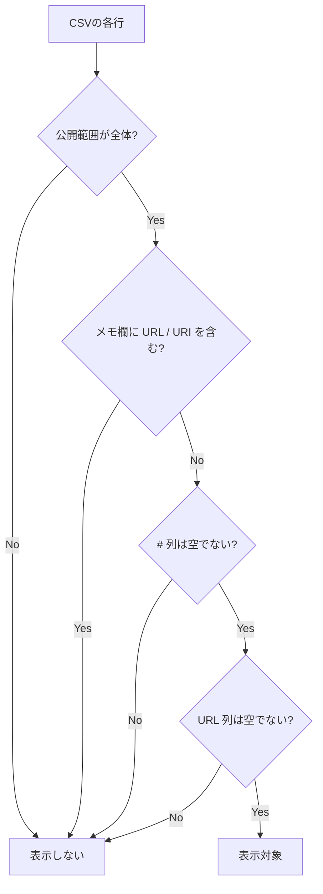

# 鐘輝かう 歌サーチ

公開URL: [https://an-oa.github.io/knksongs/](https://an-oa.github.io/knksongs/)

- 公開スプレッドシート由来の歌データを、曲名・アーティスト名(読み含む)で検索できるシンプルなWebサイトです。
- PC / スマホ両対応です。本サイト運営者のサーバへ個人情報を送信したり、独自の解析用トラッキングを行いません(設定保持のためにローカルストレージを使用します)。
- 通常の曲データ表示では GitHub Pages 上の生成済みJSONを取得します。JSON生成やフォールバック時には Google(スプレッドシートのCSV取得)、YouTube表示では youtube.com / youtube-nocookie.com やサムネイル配信元などへの通信が発生します。

---

## 目次

- [主な機能](#主な機能)
- [表示対象の条件(重要)](#表示対象の条件重要)
- [使い方](#使い方)
- [データソース(開発者向けメモ)](#データソース開発者向けメモ)
- [テスト/静的解析(開発者向け)](#テスト静的解析開発者向け)
- [設定の保存について](#設定の保存について)
- [免責事項・権利について](#免責事項権利について)

---

## 主な機能

- 曲名 / アーティスト名で検索できます。
  - ひらがな/カタカナ等の読みでも検索できます。
  - 複数キーワード(スペース区切り)に対応します(全角スペースも可)。
  - `since:YYYY-MM-DD` で指定日以降、`until:YYYY-MM-DD` で指定日以前に絞り込めます。
    年だけを指定すると `since` は1月1日、`until` は12月31日、年月を指定すると
    `since` は月初、`until` は月末を包含境界として使います。年・年月の末尾の `-` も省略入力として扱います。
    既存のFrom/To日付範囲と併用した場合は共通部分を検索します。
  - 同じ日付演算子を複数指定した場合、`since` は最も新しい日、`until` は最も古い日を使います。
    日付らしい不正な値や矛盾した範囲は、入力中またはフォーカスを外したときに通知し、結果を0件にします。
  - `until:なんちゃら` のように日付として始まらない文字列は通常キーワードとして検索します。
    日付演算子の形をした文字列を検索する場合は、`"until:2026-13"` のように二重引用符で囲みます。
    空白を含む `"Song until:2026"` も1つのフレーズとして検索できます。引用符は検索要素の境界になるため、
    `foo"bar baz"qux` は `foo`、`bar baz`、`qux` のAND検索になります。
  - 引用句内の前後空白は無視し、連続空白は1つに揃えます。空引用句は検索条件として無視され、
    `""` だけを入力して他の絞り込みがなければおすすめ表示になります。不正な日付や構文エラーは0件表示を優先します。
  - 引用句内では `\"` で引用符、`\\` でバックスラッシュを検索できます。
    全角の `＂` / `＼` も互換文字として構文に使えますが、スマート引用符の `“”` は通常文字として検索します。
    日付演算子は完全に引用されていない要素だけを認識するため、`since:"2024"` は不正な演算子になります。
- 絞り込みができます。
  - 配信 / オリ曲/歌みた / ショート / 切り抜き / 収録。
  - UI上では `オリ曲` を `歌みた` と同じ項目(「オリ曲/歌みた」)で扱います。
  - 歌枠リレー / ハモリあり / コラボ(ホスト) / コラボ(ゲスト)。
    `コラボ(ホスト)` は配信上の立場が `ホスト`、`コラボ(ゲスト)` は `ゲスト`
    の行を対象にします。両方選択するとホスト・ゲストの両方を対象にします。
  - 条件はサイドバー(検索メニュー)から操作できます。
- YouTubeへのリンクがあります。
  - 一覧の曲名リンクから該当動画へ遷移できます。
  - サムネイル表示をONにした場合、サムネイルをクリックしてページ内で埋め込み再生できます(×で閉じてサムネに戻ります)。
  - 埋め込み再生は標準では `youtube.com` 埋め込みを使用し、設定の `プライバシー強化` がONの場合は `youtube-nocookie.com` 埋め込みを使用します(曲名リンクは通常の `youtube.com` / `youtu.be` を開きます)。
    - CSVの終了時刻がある曲は、その時刻を埋め込み再生の終了位置として使います。
    - 一部のモバイル環境では、再生開始時刻が反映されない場合があります(端末/ブラウザ/YouTube側の挙動差によります)。
- 段階表示(追加読み込み)に対応します。
  - 検索結果/ブックマーク結果/おすすめは、最初に一定件数を表示し、一覧の末尾へスクロールすると追加表示します(負荷対策)。
  - 1列の画面では、初期表示を約2画面分(最低12件、従来の初期件数が上限)に抑えます。おすすめの選曲結果は保持し、続きを同じ順番で追加します。
- ブックマーク機能があります。
  - ブックマークを作成し、名称変更/削除できます。
  - 各曲を追加/削除できます。
  - 曲の追加先ブックマーク選択や新規作成は、サイドバー内のブックマークパネルで行います。
  - ブックマークを選択すると、その中で通常の検索/絞り込みができます。
  - ブックマーク表示中は、各カードのドラッグハンドルで曲順を並び替えできます（通常表示/おすすめ表示ではハンドルは表示されません）。
  - 並び替えた順序はブックマーク情報として保存され、次回表示時にも維持されます。
  - ブックマークパネルからJSON形式でエクスポート/インポートできます。
    - インポートは現在のブックマークを全置き換えします。
  - ブックマーク保存用の曲参照は `videoId::##` を優先し、既存データの `archiveId::##` は読み込み時に段階移行します。
  - 最新データに対応する曲が一時的に存在しない参照は削除せず保存し、その曲が再び配信データへ含まれた場合に復帰できるようにします。
  - 行位置が変わると別の曲を指す旧形式の数値参照は、誤変換や上限件数の消費を避けるため読み込み時に除外します。
  - 一方で画面内部のカード識別や描画再利用には、従来どおり `archiveId::##` ベースの `songKey` を使い続けます。
  - 上限は「ブックマーク数: 最大20件」「1ブックマークあたり: 最大120曲」「ブックマーク名: 最大64文字」です。
- 初期表示(おすすめ)があります。
  - 通常表示で検索条件が未指定のときは、一定回数以上歌われた曲からおすすめ表示します。
  - おすすめ候補は配信上の立場が `ゲスト` 以外の行から抽出します。
  - ただしオリ曲は、1回(1動画)でもおすすめ候補に含みます。
  - おすすめ一覧は条件変更でおすすめ表示を離れて戻っても維持されます。曲データは初回表示前に確定し、
    公開側の更新はページの再読み込み時に確認します。
- 表示テーマを切り替えられます。
  - ダークモード切替に対応します(設定はブラウザに保存されます)。
- 設定パネルで表示/再生設定を切り替えられます。
  - 表示: サムネイル表示 / ダークモード
  - 再生: サムネイル表示ON時のみ、`youtube-nocookie.com` を使うプライバシー強化設定と、曲の終了時刻で止めずにアーカイブ全体を再生する設定を切り替えられます。

---

## 表示対象の条件(重要)

このツールは、スプレッドシート(CSV)から取り込んだ全行を表示するわけではありません。次の条件を満たす行のみ表示対象になります。

1. 公開範囲列の値が「全体」であること。
2. 非公開に配慮し、メモ欄(コメント等)に `URL` / `URI` を含む行は表示しないこと。
3. `#` 列(行ID列)が空でないこと。
4. `URL` 列が空でないこと。

いずれかに該当しない行は一覧に表示されません。
URLが空の行は、かつてアーカイブが存在した現在再生できない曲としてCSVには残しますが、
サムネイル表示・動画再生に使う派生JSONからは正常に除外します。

---

## 使い方

1. サイドバーの検索条件で、必要な絞り込みを設定します。
2. 検索ボックスに曲名 / アーティスト名(読みでも可)を入力します。
   日付で絞り込む場合は、`since:YYYY[-MM[-DD]]` / `until:YYYY[-MM[-DD]]` も同じボックスへ入力できます。
   日付演算子の形をした文字列は、二重引用符で囲むと通常の検索フレーズとして扱われます。
3. 結果一覧が更新されます。
4. 各行の曲名リンクで動画を開けます。
   - サムネイル表示をONにしている場合は、サムネクリックでページ内再生もできます。

---

## データソース(開発者向けメモ)

- 公開スプレッドシートのCSVを唯一のマスターデータとし、`songs.json` / `songs-meta.json` は
  現在表示・再生可能な行だけを収録する派生成果物として扱います。JSONを直接修正したり、
  JSONからCSVへデータを戻したりする更新経路は設けません。
- 起動時は小さい `startup` module からデータ取得を開始し、UI module の取得・初期化と並行して進めます。
  取得結果は1つのPromiseを共有するため、UI到着時の二重取得や、キャッシュがある場合の不要なJSON本体取得は行いません。
- 通常の起動時は事前生成された `data/songs-meta.json` を確認してから曲データを表示します。
  有効なJSONキャッシュの `contentHash` が公開metaと一致すれば再利用し、異なる場合は `data/songs.json` を
  取得・検証して初回表示に使います。キャッシュがない場合はmetaとJSON本体を並行取得します。
- 公開側の内容を基準とし、キャッシュの生成日時が新しくても、hashが異なる公開JSONへ置き換えます。
  meta取得失敗時もJSON本体を試します。JSON取得・検証に失敗した場合だけ有効なJSONキャッシュへ退避し、
  キャッシュもなければネットワークCSVへ進みます。
- `songs.json` / `songs-meta.json` はschema Version 3として、同じ `contentHash` とUTC ISO 8601形式の
  `generatedAt` を持ちます。公開JSON本体はmetaとhashが一致するか、metaより生成日時が新しい場合に採用します。
  metaより古いJSONや、同じ生成日時でhashが異なるJSONは採用しません。
  `generatedAt` はcontentHashが変わった場合だけ更新するため、CSVに変更がない定期生成では差分が発生しません。
- 有効なJSONキャッシュがある場合、公開metaとJSON本体の通信は合計で最大5秒待ちます。
  期限を超えた通信は中断してキャッシュへ退避し、遅れて届いた応答は採用しません。
  metaはresponse受信と本文読込に各2秒、JSON本体はresponse受信に2秒・本文読込に30秒の段階別期限も持ち、
  共通の5秒期限と段階別期限の早い方で打ち切ります。キャッシュがない場合は段階別期限だけを適用します。
  CSVはresponse受信に3秒・本文読込に30秒の期限を設けます。
- 採用した公開JSONはIndexedDBへの保存を開始し、保存完了を待たずに検証済みデータを初回表示へ反映します。
  保存が遅い場合や失敗した場合も検索・表示を利用できます。表示後の自動再取得・次回検索での差し替えは行わず、
  キャッシュへ退避した場合も公開側の再確認はページの再読み込み時に行います。
- 旧localStorageキャッシュの読み取りでは移行保存を待ちません。最終的に採用したJSONだけを保存し、成功後に旧キャッシュを削除します。
- 不正・旧schemaのキャッシュは未キャッシュとして公開JSON、ネットワークCSVの順に再取得します。公開JSONを採用できれば上書きし、採用できなければ削除を非同期で開始します。
- 公開スプレッドシートのCSVは、事前生成JSONの元データかつJSON取得失敗時のフォールバックとして参照します(`app/config.mts` の `PUBLIC_CSV_URL` で指定し、実行時は `_build/app/config.mjs` に生成された module を読みます)。
  公開JSONも有効なJSONキャッシュも利用できない場合にCSVを取得します。CSVはキャッシュしません。
  旧バージョンが保存したCSVキャッシュは初期データ決定後に非同期で削除します。
- CSVの `配信上の立場` は曲データの `streamRole` としてJSONへ保持します。
- CSVから公開対象曲を変換した直後に、必須文字列、YouTube URL・動画ID、再生範囲を全件検証します。
  `archiveOrder`と曲参照キーの生成規則・一意性も検証します。問題がある場合はCSV行番号を報告し、
  どちらのJSONも書き換えません。開始位置`0`と終了位置`null`は、
  動画全体を再生する正常値として扱います。ブラウザのCSVフォールバックも同じ変換・検証を使用します。
  行番号は検証中だけ曲候補と対にして保持し、曲データや`songs.json`へは出力しません。
- `npm run validate:songs-json` は曲データの意味を再判定せず、2つの派生JSONの構文、
  各曲の必須フィールド・型・未知フィールドと曲参照キーの一意性を含むスキーマ、
  `contentHash`と`generatedAt`同士、
  および曲配列から再計算したhashとの一致を検証します。
- `.github/workflows/update-songs-json.yml` は GitHub Actions 上で `npm run build:songs-json` と
  `npm run validate:songs-json` を実行し、`data/songs.json` / `data/songs-meta.json` だけに
  差分があることを確認します。差分があれば `APP_CLIENT_ID` repository variable と
  `APP_PRIVATE_KEY` repository secret から現在のリポジトリだけに有効な GitHub App token を作り、
  App の bot user としてコミットして `main` へ push します。この通常の push を起点に CI が動き、
  差分がない場合は token 発行、コミット、CI、deploy のいずれも行いません。
  App は対象リポジトリだけへインストールし、Repository permissions は
  Contents の Read and write だけを付与します。
- `.github/workflows/ci.yml` は `main` への push / pull request / 手動実行で `npm run validate:songs-json`、`npm run typecheck`、`npm run check:ts-emit`、`npm run build`、`npm run lint`、`npm run test:unit` を実行します。`main` の CI が成功すると `.github/workflows/deploy-pages.yml` が検証済み commit を deploy します。
- `.github/workflows/deploy-pages.yml` は workflow 全体を `queue: max` の concurrency で直列化し、成功した CI の対象を build 前、artifact 生成後、environment 待機後の deploy action 直前に `main` と照合します。待機前に古くなった run は deploy job ごと skip し、待機中に古くなった run は古い artifact を公開せず失敗として記録します。deploy 後は公開 `deployment.json` の SHA が対象 commit と一致するまで最長10分間確認し、最後に対象 commit が引き続き `main` であることを再確認してから workflow を成功扱いにします。
- `Deploy Pages` のいずれかの job が失敗または cancel されると、`deploy-pages-failure` label と機械判定用markerを持つ公開 Issue を作成して repository owner へ assign します。同じ障害の未解決 Issue があれば新規作成せず、対象 commit、run URL、各 job の結果、検知時刻をコメントとして追記します。その後に Pages deploy が成功した場合だけ復旧コメントを付けて Issue を閉じ、古い対象の skip では閉じません。Issue 更新前に、failureまたはrecoveryの通知を完了した新しい workflow run の有無と現在の `main` SHA を再確認し、queued、notify未完了のcancelled、failure/recoveryを生じないskip構成の run だけでは古い通知を抑止しません。Issue API は一時失敗時を含めて最大3回試行し、復旧処理を完了できない場合は notify job を失敗させます。メールアドレス、secret、workflow log 本文は Issue に記録しません。
- `main` の SHA 照合と Pages deploy API の実行は原子的ではないため、両者の間に `main` が進んだ場合は古い artifact が一時的に公開される可能性があります。この場合も公開後の再照合で workflow を失敗させますが、公開自体を原子的に防ぐ保証はありません。
- `npm run build` がJavaScriptの内容ハッシュ付きファイル名とCSSの `?v=<sha256>` を決定し、HTML・preload・importのURLを揃えます。Pages artifactはURLや生成JavaScriptを書き換えず、`browser`・静的asset・曲JSONだけを `_site` へコピーします。`_build/app` はNode tests・scripts用で配布しません。明示バージョンはビルド時の `DEPLOY_CACHE_BUSTER` または `npm run build -- --cache-buster <version>` で指定します（artifactコマンドの `--cache-buster` は廃止）。deploy SHAは `deployment.json` に記録するため、曲JSONやemit側コメントだけの変更でCSS/JavaScriptのURLは変わりません。
- フロントエンドのみで動作します(静的ホスティング想定)。
- 配布物はHTML/CSS/JavaScriptのみで、実行時にnpm等の同梱依存はありません。
- `app/**/*.mts` は source として扱い、テスト・Node scripts は `npm run build:ts` で `_build/app/**/*.mjs` に生成された module を読みます。ブラウザ用には `npm run build` がこのemit結果をesbuildで `_build/browser` のES module bundleへまとめます。生成 `.mjs` は Git 管理対象外です。fresh checkout 後や `.mts` 変更後にブラウザで確認する場合は、`npm run build` を実行し `_build` を配信してください。`build:ts` 単体ではブラウザ用bundleを更新しません。`npm run check:ts-emit` は `_build/app` の生成 `.mjs` が存在し、`app` source tree に `.mjs` が残っていないことを確認します。`npm run build` は静的 asset と TypeScript 生成 module を `_build` へ作成し、`npm run build:pages-artifact` は `_build` を元に `_site` を作成します。`npm run typecheck` / `npm run lint` / `npm run test:unit` / `npm run build:songs-json` / `npm run validate:songs-json` は事前に `build:ts` を実行します。`npm run build:pages-artifact` は事前に `npm run build` を実行し、`npm run test:e2e` はそのPages artifactを検証します。
- ブラウザ用bundleは小さい起動処理、UI、共有処理へ分割し、UIと共有処理の `modulepreload` をbuild時にHTMLへ生成します。HTML解析時に必要なファイルを並行取得できるため、module依存先を順に発見する通信待ちを減らします。esbuildは開発依存のみで、実行時の外部ライブラリは追加しません。
- サムネイル表示/埋め込み再生まわりでは YouTube Iframe API を動的に利用します。
- 開発時の静的解析は TypeScript noEmit typecheck と ESLint を利用します。
- 開発時テストは Node.js 標準の `node:test` を利用します。
- ブラウザ回帰確認として Playwright による Chromium スモークテストを用意しています。

## テスト/静的解析(開発者向け)

- 現在は以下のテストを用意しています。
  - ブックマークのインポート/エクスポートUIのテスト (`tests/bookmark-import-export-ui.test.mjs`)
  - ブックマーク保存スキーマ/移行のテスト (`tests/bookmark-storage-schema.test.mjs`)
  - ブックマークJSON転送のテスト (`tests/bookmark-transfer.test.mjs`)
  - ブックマークUIのテスト (`tests/bookmark-ui.test.mjs`)
  - アプリ初期状態のテスト (`tests/app-state.test.mjs`)
  - 配信上の立場の正規化/判定テスト (`tests/stream-role.test.mjs`)
  - CSVパースのテスト (`tests/csv-parser.test.mjs`)
  - 初期データ読み込み後の状態反映テスト (`tests/data-loader.test.mjs`)
  - DOM補助関数のテスト (`tests/dom-utils.test.mjs`)
  - 日付キーと部分日付の正規化/範囲判定テスト (`tests/date-key.test.mjs`, `tests/partial-date.test.mjs`)
  - 検索クエリの解析/入力エラー表示テスト (`tests/search-query.test.mjs`, `tests/search-query-validation.test.mjs`)
  - 楽曲の絞り込み/おすすめ選曲テスト (`tests/search-filters.test.mjs`, `tests/search-recommendation.test.mjs`)
  - 日付フィルターUI controllerのテスト (`tests/date-filter-controller.test.mjs`)
  - 検索/ブックマーク/おすすめ表示controllerのテスト (`tests/search-controller.test.mjs`)
  - 楽曲形式の分類/選択判定テスト (`tests/song-format.test.mjs`)
  - 検索booleanフィルター共有helperのテスト (`tests/search-boolean-filters.test.mjs`)
  - フォーマット表示ラベルのテスト (`tests/format-filter.test.mjs`)
  - Pages artifact生成とブラウザ成果物URLのテスト (`tests/pages-artifact.test.mjs` / `tests/browser-build.test.mjs`)
  - 再生継続候補の選択ロジック (`tests/playback-sequence.test.mjs`)
  - 再生セッション制御のテスト (`tests/playback-session-controller.test.mjs`)
  - 再生設定値reducerのテスト (`tests/playback-settings-value-reducer.test.mjs`)
  - 描画/レイアウトまわりの回帰テスト (`tests/render-layout.test.mjs`)
  - ブックマーク時のドラッグ並び替えテスト (`tests/render-drag-reorder.test.mjs`)
  - masonryレイアウト計算のテスト (`tests/render-masonry-layout.test.mjs`)
  - レイアウト補正待機のテスト (`tests/layout-anchor.test.mjs`)
  - 結果一覧スクロール制御のテスト (`tests/results-scroll.test.mjs`)
  - 検索フィルターUI controllerのテスト (`tests/search-filters-controller.test.mjs`)
  - 検索状態保存schemaのテスト (`tests/search-state-schema.test.mjs`)
  - サイドバーUIのテスト (`tests/sidebar-ui.test.mjs`)
  - 曲データJSONのcontent hash算出テスト (`tests/songs-content-hash.test.mjs`)
  - 曲データソースのJSON優先読み込み/CSVフォールバック/キャッシュ更新テスト (`tests/songs-data-source.test.mjs`)
  - 曲データJSONキャッシュのIndexedDB/旧localStorage移行テスト (`tests/songs-json-cache.test.mjs`)
  - 曲データJSONスキーマのテスト (`tests/songs-json.test.mjs`)
  - CSV由来の曲データ品質検証テスト (`tests/songs-data-quality.test.mjs`)
  - 曲データJSON生成の書き出し前検証テスト (`tests/build-songs-json.test.mjs`)
  - 派生JSONのスキーマ・hash整合性検証テスト (`tests/songs-json-validation.test.mjs`)
  - ストレージ(ブックマーク上限/リネーム)の単体テスト (`tests/storage-bookmark-limit.test.mjs`)
  - ストレージ(検索状態保存/復元)の単体テスト (`tests/storage-search-state.test.mjs`)
  - UI設定/ストレージ互換のテスト (`tests/ui-storage-compat.test.mjs`)
  - UI同期のテスト (`tests/ui-sync.test.mjs`)
  - YouTubeサムネイル/埋め込み再生まわりの統合テスト (`tests/youtube-controller.test.mjs`)
  - YouTube埋め込みURL/API loader のテスト (`tests/youtube-embed.test.mjs`)
  - YouTube playback state / start attempt / player adapter の単体テスト (`tests/youtube-playback-state.test.mjs`, `tests/youtube-playback-start-attempt.test.mjs`, `tests/youtube-player-adapter.test.mjs`)
  - YouTube shared playback / thumbnail helper / unconfirmed playback start の単体テスト (`tests/youtube-shared-playback.test.mjs`, `tests/youtube-thumbnail.test.mjs`, `tests/youtube-unconfirmed-playback-start.test.mjs`)
  - Chromium 上での YouTube 再生スモークテスト (`tests/e2e/youtube-smoke.spec.mjs`)
- `tests/test-helpers.mjs`、`tests/youtube-harness.mjs`、`tests/support/playback-settings-fixture.mjs`、`tests/e2e/support/mock-youtube.mjs`、`tests/e2e/support/ui-helpers.mjs` は複数テストで共有する補助モジュールです。
- 実行コマンド:
  - `npm run validate:songs-json`
  - `npm run build:ts`
  - `npm run typecheck`
  - `npm run check:ts-emit`
  - `npm run build`
  - `npm run lint`
  - `npm run test:unit` (`node --test tests/*.mjs`)
  - `npm run test:e2e`
- 初回または `node_modules` がない環境では、検証コマンドの前に
  `npm install` を実行してください。
- `npm run lint` は `package.json` の devDependencies にある ESLint を
  使う前提です。`node_modules` がない場合、環境側の古い ESLint が
  実行されることがあります。
- Playwright のスモークテストを初回実行する前に、以下を準備してください。
  - `npx playwright install chromium`
  - `python3` が PATH 上で利用できること
- Playwright のスモークテストでは、静的サイトはローカル配信し、CSV と YouTube Iframe API は mock / fixture に差し替えて回帰確認します。
- `npm run test:e2e` は事前に `npm run build:pages-artifact` で `_site` を作り、Playwright 側で `python3 -m http.server 4173 --bind 127.0.0.1 --directory _site` を起動して静的サイトを配信します。
- 現時点の Playwright 対象は Chromium です。iOS Safari は別途、実機または手動スモーク確認を想定します。

---

## 設定の保存について

このツールはサーバへ設定を送信しません。ただし、使い勝手のため以下をブラウザのローカルストレージまたは IndexedDB に保存します。

- テーマ(ダーク/ライト)。
- サムネイル表示ON/OFF。
- 再生設定(プライバシー強化ON/OFF、アーカイブ全体を再生ON/OFF)。
- 検索状態(検索語・絞り込み条件・日付条件・選択中のブックマーク)。
  - localStorage key は既存利用者の互換維持のため `searchStateV1` のままです。
    payload 内の `version` は保存 schema の版数で、key 名とは独立して更新します。
- ブックマーク情報(ブックマーク名・曲の対応/順序・作成日時)。
  - 保存形式は version 付き payload で管理し、旧形式は読み込み後に現行形式へ保存し直します。
- 曲データJSONのキャッシュ(IndexedDB。旧localStorageキャッシュは読み込み時に移行します)。
- テーマはローカルストレージを優先し、未設定時のみOSの配色設定に従います。

ブラウザのデータ削除を行うと、これらの保存内容はリセットされます。

---

## 免責事項・権利について

- 本ツールはファンによる非公式プロジェクトであり、鐘輝かう様ご本人および所属団体とは関係ありません。
- 本ツール内で表示される名称・画像・動画等の権利は各権利者に帰属します。
- 権利者様からの修正・削除のご要望があれば、Issue等でご連絡ください。速やかに対応します。
